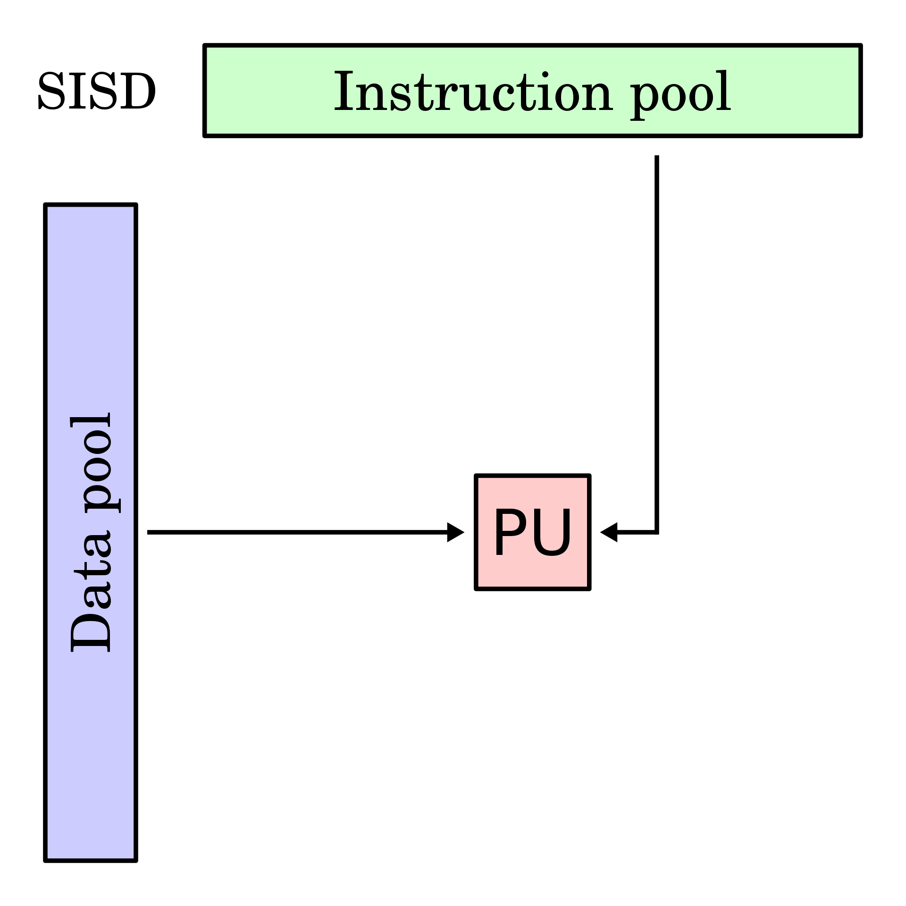
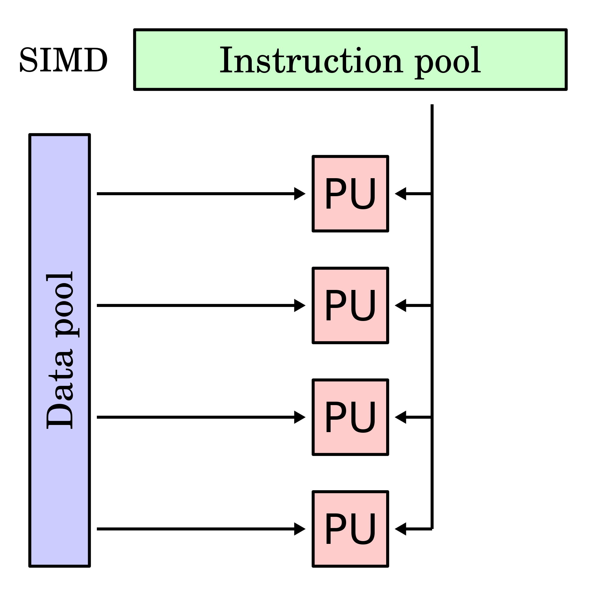
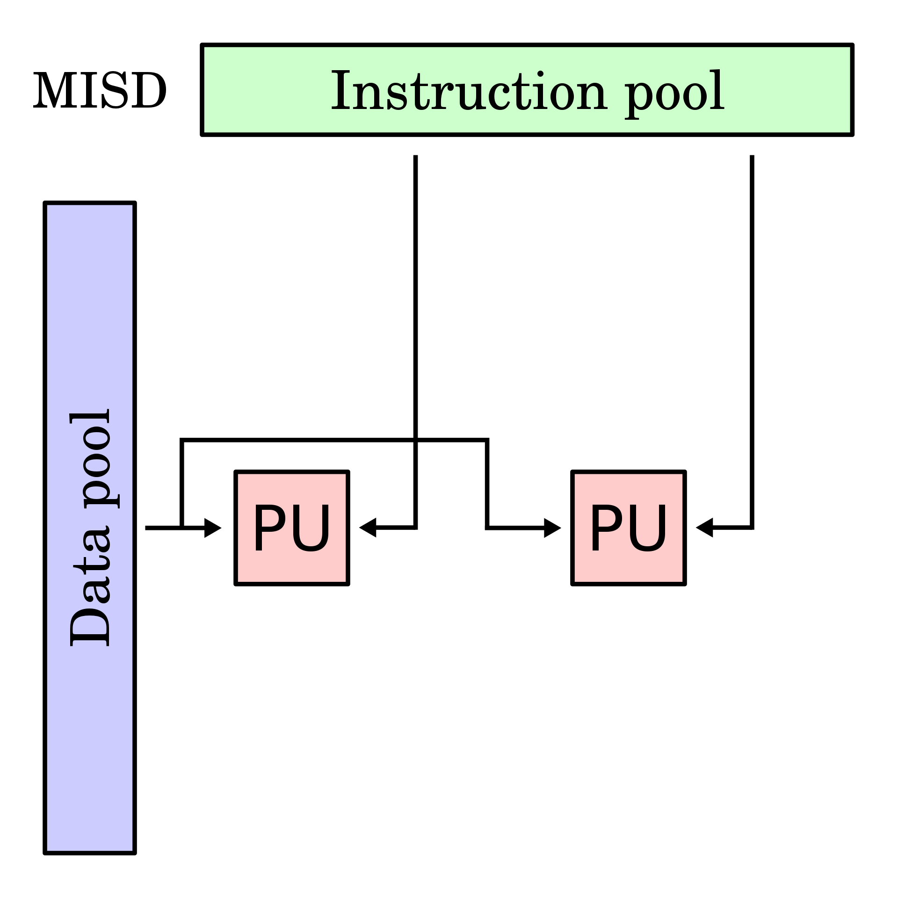
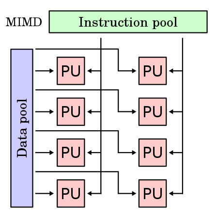
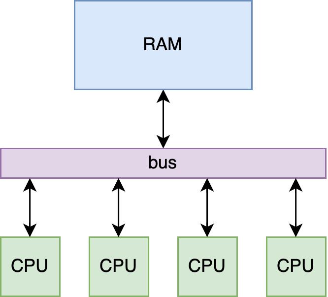
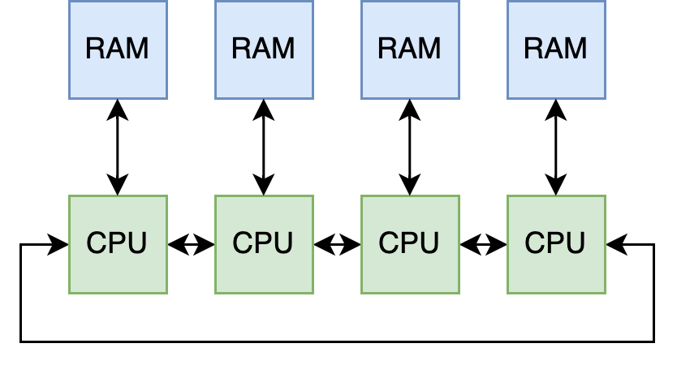
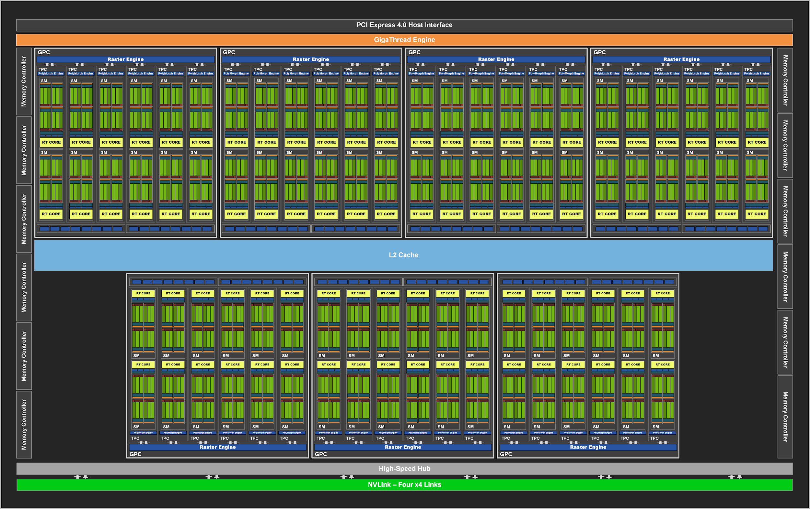
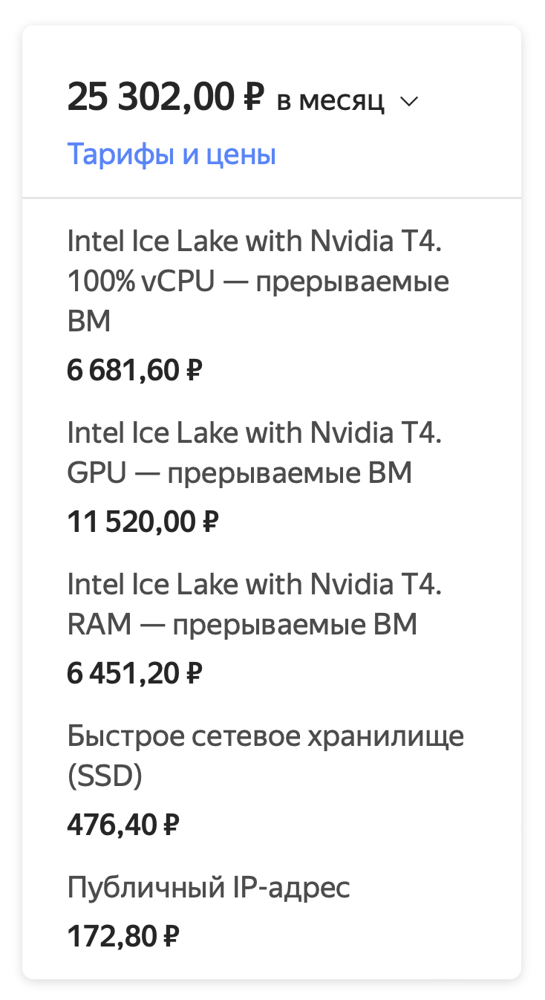
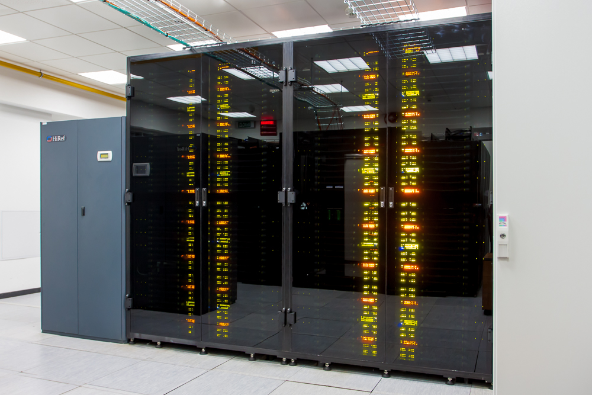
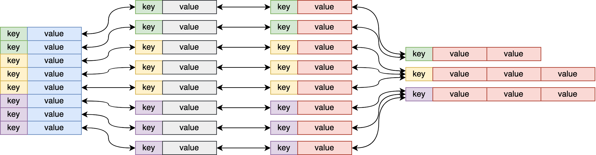

# Основы параллельных вычислений
<!-- _backgroundColor: #99d6ff -->

<br/><br/>

Бикулов Дмитрий, к.ф.-м.н., техлид в Яндексе

---
# План
<!-- _backgroundColor: #eee -->

1. Архитектуры
2. Программирование
3. Примеры вокруг

---

# Основные архитектуры
<!-- _backgroundColor: #99d6ff -->
<!-- _color: #222 -->

---

<div class="columns">
<div>

## Классификация Флинна

1. **S**ingle **I**nstruction, **S**ingle **D**ata
2. **M**ultiple **I**nstruction, **S**ingle **D**ata
3. **S**ingle **I**nstruction, **M**ultiple **D**ata
4. **M**ultiple **I**nstruction, **M**ultiple **D**ata

</div>
<div>

<div class="columns">
<div>




</div>
<div>




</div>
</div>

</div>

[wiki:Таксономия_Флинна](https://ru.wikipedia.org/wiki/Таксономия_Флинна)

---

## По доступу к памяти

<div class="columns">
<div>

Shared



</div>
<div>

Distributed

<br/>
<br/>



</div>
</div>

---

<div class="columns">
<div>

## Другие классификации

- Классификация Фенга
- Классификация Шнайдера
- Классификация Джонсона
- https://parallel.ru/search/node/классификация

</div>
<div>


</div>
</div>

---

## Фактически доступно
- собственный ноутбук
- видеокарта
- один или несколько серверов в облаке
- *суперкомпьютер*

---

## Собственный ноутбук
Ограничения:
- мало ресурсов
- не масштабируется
- обжигает коленки

Плюсы:
- привычно
- быстрый запуск и отладка
- можно сразу добавить любую визуализацию

---

## Видеокарты
Ограничения:
- хороши только для некоторого класса задач
- нужно писать код специально под них

Плюсы:
- можно получить x10 производительности
- энергоэффективны

<br>

[Ampere GA102 GPU Architecture whitepaper](https://www.nvidia.com/content/PDF/nvidia-ampere-ga-102-gpu-architecture-whitepaper-v2.1.pdf)

---



---

<div class="columns">
<div>

## Облака
Ограничения:
- дорого
- непривычно
- консолька

Плюсы:
- масштабируется
- есть видеокарты

<br>

[Экскурсия по ДЦ Яндекса](https://www.youtube.com/watch?v=xbNPpD43uvE)

</div>
<div>



</div>
</div>

---

<div class="columns">
<div>

## Суперкомпьютеры
- Ломоносов-2 в МГУ
- [Суперкомпьютеры](https://yandex.ru/supercomputers) в Яндексе
- В [Сбере](https://sbercloud.ru/ru/christofari)

<br>

[wiki:Top500](https://ru.wikipedia.org/wiki/Top500)

</div>
<div>



картинка с сайта parallel.ru

</div>
</div>

---

## Штош

- у вас модель считается 10 минут на **ноутбуке**? Вам и так хорошо, оставайтесь на нём
- у вас гидродинамика, нейронки, конечные элементы, что-угодно-много-одинакового и в пространстве? Вам нужен **GPU**
- не лезет на один компьютер или GPU? **Облака** в помощь
- не лезет на один компьютер и в облаках тормозит? Остаётся **суперкомпьютер**


---

# Параллельность в `коде`
<!-- _backgroundColor: #99d6ff -->
<!-- _color: #222 -->

---

## OpenMP

[wiki:OpenMP](https://ru.wikipedia.org/wiki/OpenMP), openmp.cpp в примерах

```cpp
// src/openmp.cpp
std::vector<double> a, b, c;
const auto N = 1'000'000;

a.resize(N); b.resize(N); c.resize(N);

omp_set_dynamic(0);      // запретить библиотеке openmp менять число потоков во время исполнения
omp_set_num_threads(10); // установить число потоков в 10

std::chrono::steady_clock::time_point begin = std::chrono::steady_clock::now();

#pragma omp parallel for
for (size_t i = 0; i < N; ++i) {
    for (size_t j = 0; j < 1'000; ++j) {
        a[i] += std::log(j + 1 + i * 1.0);
        b[i] += std::sqrt(std::exp(i * 2.0)) + j;
        c[i] += std::sqrt(std::pow(a[i] + b[i], 3)) + j;
    }
}

std::chrono::steady_clock::time_point end = std::chrono::steady_clock::now();

std::cout << std::chrono::duration_cast<std::chrono::microseconds>(end - begin).count() << "[µs]" << std::endl;
return 0;
```

---

## MPI

[wiki:MPI](https://ru.wikipedia.org/wiki/Message_Passing_Interface), [Лекция](https://cs.petrsu.ru/~kulakov/courses/parallel/lect/mpi.pdf), [Документация](https://www.mpi-forum.org/docs/mpi-4.0/mpi40-report.pdf)

```cpp
// src/mpiex.cpp
if (processRank != 0) {
    for (size_t i = 0; i < N / clusterSize; ++i) {
        for (size_t j = 0; j < 1'000; ++j) {
            a[i] += std::log(j + 1 + i * 1.0);
            b[i] += std::sqrt(std::exp(i * 2.0)) + j;
            c[i] += std::sqrt(std::pow(a[i] + b[i], 3)) + j;
        }
    }

    MPI_Send((const void*)&a[0], N, MPI_DOUBLE, 0, 1, MPI_COMM_WORLD);
    MPI_Send((const void*)&b[0], N, MPI_DOUBLE, 0, 2, MPI_COMM_WORLD);
    MPI_Send((const void*)&c[0], N, MPI_DOUBLE, 0, 3, MPI_COMM_WORLD);
} else {

    const auto chunkSize = N / (clusterSize - 1);

    MPI_Status mpiStatus;
    for (int i = 1; i < clusterSize; ++i) {
        MPI_Recv(&a[(i-1)*chunkSize], chunkSize, MPI_DOUBLE, i, 1, MPI_COMM_WORLD, &mpiStatus);
        MPI_Recv(&b[(i-1)*chunkSize], chunkSize, MPI_DOUBLE, i, 2, MPI_COMM_WORLD, &mpiStatus);
        MPI_Recv(&c[(i-1)*chunkSize], chunkSize, MPI_DOUBLE, i, 3, MPI_COMM_WORLD, &mpiStatus);
    }

    std::chrono::steady_clock::time_point end = std::chrono::steady_clock::now();
    std::cout << std::chrono::duration_cast<std::chrono::microseconds>(end - begin).count() << "[µs]" << std::endl;
}
```

---

## Потоки

```cpp
// src/thread.cpp

void long_task(std::vector<double>& a) {
    for (auto& aa : a) {
        aa = 3 * 3;
    }
}

int main(int, char**) {
    std::vector<double> a;
    a.resize(100);

    std::thread th(long_task, std::ref(a));
    th.join();
    for (auto i = 0; i < 100; ++i) {
        std::cout << a[i] << " ";
    }
    std::cout << std::endl;

    return 0;
}
```

---

## Python: потоки, процессы и корутины

- в Python есть GIL [wiki:GIL](https://ru.wikipedia.org/wiki/Глобальная_блокировка_интерпретатора)
- [the GIL and its effects on Python multithreading](https://tenthousandmeters.com/blog/python-behind-the-scenes-13-the-gil-and-its-effects-on-python-multithreading/)
- multiprocessing
- async

---

## CUDA

```cpp
__global__ void vectorAdd(const float *A, const float *B, float *C, int numElements) {
    int i = blockDim.x * blockIdx.x + threadIdx.x;

    if (i < numElements) {
        C[i] = A[i] + B[i] + 0.0f;
    }
}

int main(void) {
    // ...
    float *h_A = (float *)malloc(size);
    // ...

    for (int i = 0; i < numElements; ++i) {
        h_A[i] = rand() / (float)RAND_MAX;
        // ...
    }

    float *d_A = NULL;
    cudaMalloc((void **)&d_A, size);

    // ...
    cudaMemcpy(d_A, h_A, size, cudaMemcpyHostToDevice);
    // ...

    int threadsPerBlock = 256;
    int blocksPerGrid = (numElements + threadsPerBlock - 1) / threadsPerBlock;

    vectorAdd<<<blocksPerGrid, threadsPerBlock>>>(d_A, d_B, d_C, numElements);

    cudaMemcpy(h_C, d_C, size, cudaMemcpyDeviceToHost);
```

---

# Полезно знать
<!-- _backgroundColor: #99d6ff -->
<!-- _color: #222 -->

---

## MapReduce



<br>

[Podlodka #258 — Распределенные вычисления](https://podlodka.io/258)

---

## Очереди

- [wiki:kafka](https://ru.wikipedia.org/wiki/Apache_Kafka)
- [RabbitMQ](https://www.rabbitmq.com/)
- ...

[Podlodka #277 -- Менеджеры очередей](https://podlodka.io/277)

---

# Примеры параллельных вычислений вокруг нас
<!-- _backgroundColor: #99d6ff -->
<!-- _color: #222 -->

---

## Гидродинамика